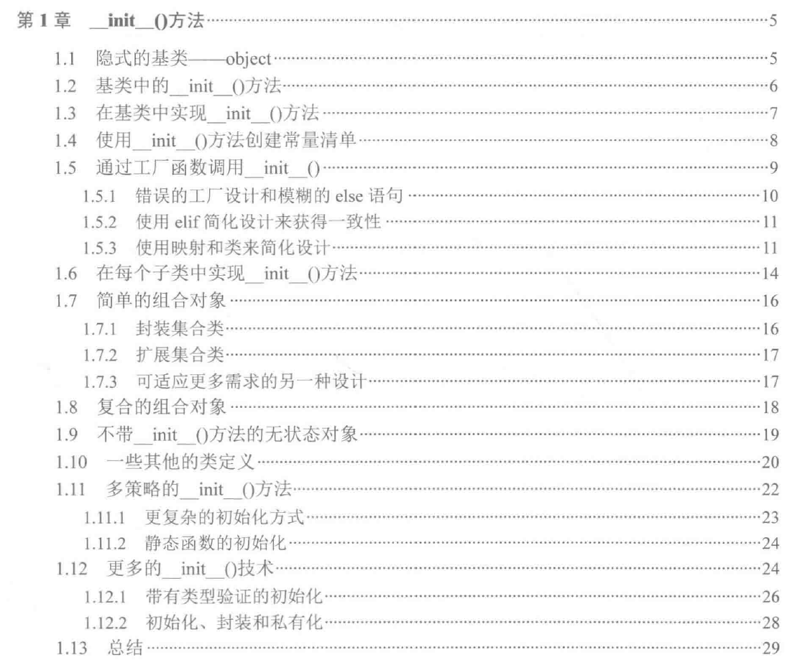

Python特殊方法，大致分为几类：

- **特性访问（Attribute Access）**：这类特殊方法实现了对象的特性访问，使用方式为obj.attribute，既可以用来赋值，也可以在del语句中执行删除操作。

- **可调用对象（Callables）**：这个方法的适用对象为参数，就像Python内部的len()函数（也是应用于参数）。

- **集合（Collections）**：提高了很多集合操作的功能

- **数字（Numbers）**：数学运算符、比较运算符

- **上下文（Context）**：这类函数通常适用with语句来实现上下文的管理

- **迭代器（Iterator）**：迭代器、生成器（Generator）

### 总结 __init__()
1. 类应禁止延迟赋值。  ——显式而非隐式， 对于每个__init__(), 都应当显式指定要初始化的变量

2. 创建常量清单， 静态常量也正构成了策略（Strategy)或状态（State)模式的一部分。

3. 实现工厂的两种途径：
> 定义一个函数，返回不同类的函数。 
> 定义一个类，包含了创建对象的方法。这是完整的工厂设计模式。复杂的情形，工厂类才是不错的选择。对于只要简单定义一个函数能做到的就没必要定义类。

4. 